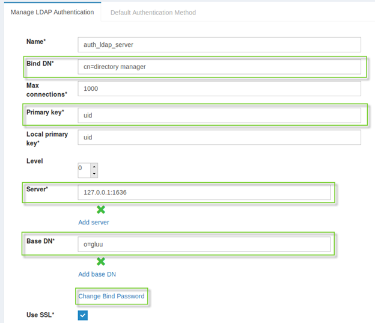

#Authentication against LDAP backend(s) (AKA “Basic”, “Internal”)

## Configuring Basic Authentication
Basic authentication is the default authentication method used by the Gluu Server out-of-the-box. The method relies on a successful LDAP BIND operation against a specified backend LDAP directory. To configure the Basic Authentication Method:

1. Click on `Configuration` > `Manage authentication` 

You can find a more detailed description of each field in 
[manage authentication](../admin-guide/oxtrust-ui/#manage-authentication) 
section under OxTrust admin UI. 

Let’s only touch concepts of `primary key` and `local primary key` for now:

•Primary key - name of LDAP attribute used to look up user entries in backend LDAP directory.

•Local primary key -  name of LDAP attribute used to look up user entries in Gluu’s 
internal LDAP directory.

##Basic Authentication Flow

Basic authentication flow can be divided into three set of phases:

1.String provided by user in the “Login” field of the login form is treated as a local key. 
It becomes a part of LDAP search filter similar to 
`&(..set of predefined filter clauses..)(local_primary_key=provided_login_name)`. 
If a user entry conforming to this filter is found in Gluu’s internal LDAP directory and 
its `gluuStatus` attribute is set to `active`, login flow continues, 
otherwise it’s deemed unsuccessful. That means that even in case when backend 
directory is used for authentication, a mirrored user entry still must be present in 
Gluu’s internal directory all the time

2.String provided by user in the “Login” field of the login form is now treated as a 
primary key. It becomes a part of LDAP search filter similar to 
`&(..set hardcoded clauses..)(primary_key=provided_login_name)`. 
If a user entry conforming to this filter is found in specified backend LDAP directory 
login flows continues, otherwise it’s deemed unsuccessful

3.LDAP BIND operation is initiated against backend LDAP directory with DN 
of user entry found on step 2; for a password it will use string provided 
by user in the “Password” field of the login form. If bind results in success, 
login flow ends and user is treated as authenticated.

By default Gluu is configured to use its own internal LDAP directory instead of 
some remote LDAP backend, so LDAP operations on steps 2 and 3 will be also executed 
against it. 

As many organizations already have existing LDAP directories with users’ 
data in their network which they would like to put to use, one of the first steps for 
them will be changing this default behavior by providing their backend server’s DNS name 
or ip address  in `Server` field. 

As login name provided by user will be used as a search 
term in searches both against remote and internal directories, that means there must be 
strict relation between user entries in those directories, ensuring they both will succeed. 

Most simple way to achieve this is to employ Cache Refresh feature which allows to set 
mappings for user attributes imported from a backend directory. 
It also allows to customize default mapping behavior with Jython-based scripts. 
You can find out more about Cache Refresh a.k.a 
[LDAP Synchronization](../user-group/#ldap-synchronization).

