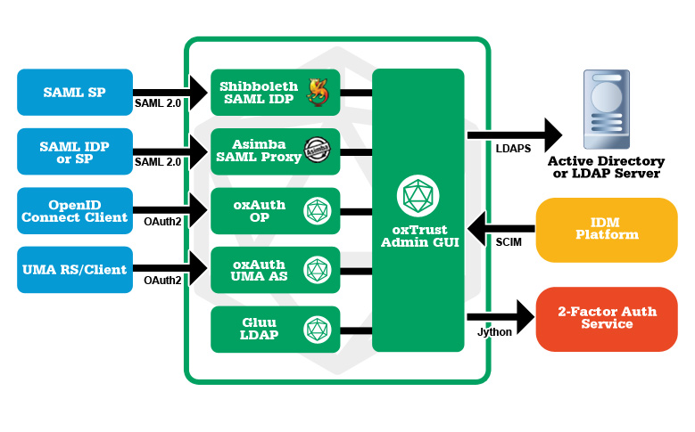

# Gluu CE Integration Guide Introduction

The Gluu Server is a container distribution composed of software written by Gluu 
and incorporated from other open source projects. Gluu projects are frequently 
prefixed with our open source handle: ox (e.g. oxAuth, oxTrust). 

The Gluu Server can include multiple components. Each one fulfills a different requirement, 
and can be included or excluded in individual deployments based on an organization’s unique requirements.

## Gluu Components for Integrating Applications

- Shibboleth is one of the most dependable open source [SAML](http://www.gluu.org/resources/documents/standards/saml-2-0/)
  single sign-on servers available and is in production at more than 5,000 organization’s worldwide.
- Asimba SAML Proxy enables an organization to consolidate inbound SAML authentication from 
  the IDPs of partners to a website or app.
- oxAuth is Gluu’s inter-op leading [OpenID Connect IDP](http://www.gluu.org/resources/documents/standards/openid-connect/) 
  and industry leading [UMA Authorization Server (AS)](http://www.gluu.org/resources/documents/standards/uma/).
- oxTrust is the server administration application. In oxTrust, 
  the server admin can manage and configure SAML & OpenID Connect single sign-on, 
  and script policies to enforce custom authentication workflows and control access 
  to web resources like folders and API’s.

SaaS, custom, open source and commercial software can be made more 
secure by leveraging a central authentication and authorization service. 
Because there are so many different kinds of apps, there is no way to “top down” 
implement proprietary security mechanisms. This is why open standards are so important for IAM.

The Gluu Server is like a router for authentication and authorization. 
It speaks multiple dialects of SSO, and can help an organization manage both inbound and outbound 
authentication and authorization requirements. The Gluu Server is flexible enough to enforce any 
policy you can script and can be scaled to meet the needs of organizations of all sizes.

### Integration Documentation
This section of the document discuss more on the integrations using above mentioned 
methods and protocols to achieve required functinality without comprising security and cost.

This guide is classified into 3 parts of integration

- Client SDKs
    - Client SDKs discussed on the OXD OAUTH product developed by Gluu server, 
      used as a plugin to connect to various systems.
- Web Server Integrations
    - Web Server integration discusses on the methods or protocols that 
      can used to integrate applications with Gluu CE Server, such as, shibboleth2.0, mod_auth_oidc
- SaaS Integrations
    - Saas Integrations are those, where social or cloud based applications are integrated using Gluu CE server
      incorporating Gluu internal mechanism or custom scripts.

Each section discusses more on in detail about each of the integration methods used in Gluu CE Server.

